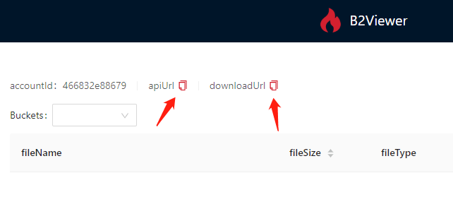

<p align="center"></p>
<h1 align="center">B2Viewer</h1>
<h3 align="center">A web file browser for Backblaze B2, based on React.</h3>
<p align="center">


</p>

## How to use:

Install dependencies,

```bash
$ yarn
```

Start the dev server,

```bash
$ yarn start
```

Open localhost:3003 in browser.

Replace the BASE_URL in `/src/config.js` with your downloadUrl, Replace the /api proxy target in `.umirc.ts` with your apiUrl. 

**Notes:** 
You can copy downloadUrl and apiUrl after you log in.



## What works:

- Browsing buckets and Files
- Image gallery and Video player
- Easy to copy file's link

## What could be improved/added:

- Upload capabilities (Files and folders to sync)
- Delete capabilities (Files and Buckets)